# bank-attribute-service

High-throughput transaction → ML feature pipeline.
Accepts a batch of raw bank transactions and returns per-account attribute vectors with risk scoring decisions.

---

## Performance

| Scenario | Time |
|----------|------|
| 100k transactions → 1,000 accounts | **~1.2s end-to-end** |
| 1M transactions → 10,000 accounts | **~14.7s end-to-end** |
| Cache hit (Redis) | **<50ms** |

---

## Architecture



```
Plaid API / Batch POST / generate_data.py
              │
              ▼
      FastAPI  ·  POST /attributes  ·  GET /demo/plaid
      Rate limiter · Pydantic v2 validation
              │                        │
              ▼                        ▼ fire & forget
        Redis cache              Kafka (KRaft)
        SHA-256 key              raw_transactions topic
        TTL 5 min                → fraud svc, ML retraining
              │
              ▼
         Normalizer
         dedup · dtype enforcement
              │
              ▼
        Polars engine
        single lazy group_by + agg · streaming · async
              │
              ▼
       Metric registry
       txn volume · recency · spend category · channel · cash flow
              │
              ▼
         Risk scorer
         net_flow · salary · overdraft_risk · inactivity
              │
     ┌────────┼────────┐
     ▼        ▼        ▼
  APPROVE   REVIEW  DECLINE
  score≥70  50–69   <50
```

**Stack:** FastAPI · Polars (lazy + streaming) · Pydantic v2 · Redis · Kafka (KRaft) · Plaid · pytest

---

## Quick Start

### Option A – Local (no Docker)

```bash
# 1. Install dependencies
pip install -r requirements.txt

# 2. Copy and configure environment
cp .env.example .env

# 3. Start Redis and Kafka
docker compose up redis kafka

# 4. Start the service
uvicorn app.main:app --reload

# 5. Generate test data
make generate

# 6. POST 100k transactions
make demo
```

### Option B – Docker Compose (all services)

```bash
make build
make up
```

---

## Makefile

```bash
make build      # build Docker image
make up         # start all services
make down       # stop all services
make generate   # generate 100k synthetic transactions
make demo       # POST 100k records and show response
make test       # run pytest suite
make plaid      # run end-to-end Plaid sandbox demo
```

---

## API

### `GET /health`

```json
{ "status": "ok", "version": "1.0.0" }
```

### `POST /attributes`

**Request body**

```json
{
  "transactions": [
    {
      "transaction_id": "TXN-001",
      "account_id":     "ACC-000001",
      "amount":         -45.99,
      "transaction_date": "2024-03-15",
      "merchant_category": "GROCERY",
      "channel": "POS"
    }
  ]
}
```

**Response**

```json
{
  "attributes": {
    "ACC-000001": {
      "txn_count": 1,
      "total_credit": 0.0,
      "total_debit": -45.99,
      "net_flow": -45.99,
      "avg_txn_amount": -45.99,
      "days_since_last_txn": 76,
      "days_since_first_txn": 76,
      "active_days": 1,
      "top_category": "GROCERY",
      "category_count": 1,
      "grocery_spend": -45.99,
      "salary_credit": 0.0,
      "pos_count": 1,
      "ach_count": 0,
      "atm_count": 0,
      "wire_count": 0,
      "digital_ratio": 0.0,
      "cashflow_net": -45.99,
      "cashflow_credit": 0.0,
      "cashflow_debit": -45.99,
      "cashflow_txn_count": 1,
      "risk": {
        "score": 80,
        "decision": "APPROVE",
        "risk_tier": "LOW"
      }
    }
  },
  "meta": {
    "transaction_count": 1,
    "account_count": 1,
    "metrics_computed": ["transaction_volume", "recency", "spend_category", "channel_behaviour", "cash_flow"],
    "elapsed_seconds": 0.012,
    "cache_hit": false
  }
}
```

### `GET /demo/plaid`

End-to-end Plaid sandbox demo — creates a sandbox token, fetches real transactions, runs the full attribute + risk pipeline.

```bash
make plaid
```

---

## Metrics

| Metric | Outputs | Description |
|--------|---------|-------------|
| `transaction_volume` | `txn_count`, `total_credit`, `total_debit`, `net_flow`, `avg_txn_amount` | Volume and monetary flow |
| `recency` | `days_since_last_txn`, `days_since_first_txn`, `active_days` | Temporal activity |
| `spend_category` | `top_category`, `category_count`, `grocery_spend`, `salary_credit` | MCC distribution |
| `channel_behaviour` | `pos_count`, `ach_count`, `atm_count`, `wire_count`, `digital_ratio` | Payment channel mix |
| `cash_flow` | `cashflow_net`, `cashflow_credit`, `cashflow_debit`, `cashflow_txn_count` | Rolling-window cash flow |

### Adding a metric (one line)

```python
from app.metrics.registry import metric_registry, CashFlowMetric
metric_registry.replace(CashFlowMetric(window_days=14, min_transactions=2))
```

Or write your own:

```python
class MyMetric(BaseMetric):
    name = "my_metric"
    output_columns = ["my_col"]

    def expressions(self) -> list[pl.Expr]:
        return [pl.col("amount").std().alias("my_col")]

metric_registry.register(MyMetric())
```

---

## Risk Scorer

| Signal | Effect |
|--------|--------|
| `net_flow < 0` | −20 pts |
| `salary_credit > 5000` | +15 pts |
| `days_since_last_txn > 90` | −15 pts |
| `digital_ratio > 0.4` | +10 pts |
| `cashflow_net < −500` | −10 pts |
| `overdraft_risk > 200` | −15 pts |

---

## Tests

```bash
make test
```

```
22 passed in 5.03s
tests/test_benchmark.py::TestBenchmark::test_full_pipeline_100k_under_4s PASSED
[BENCHMARK] 100k rows | normalise=0.226s | engine=0.059s | total=0.285s
```

---

## Configuration

| Variable | Default | Description |
|----------|---------|-------------|
| `REDIS_URL` | `redis://localhost:6379/0` | Redis connection string |
| `KAFKA_BOOTSTRAP_SERVERS` | `localhost:9092` | Kafka broker |
| `PLAID_CLIENT_ID` | — | Plaid API client ID |
| `PLAID_SECRET` | — | Plaid API secret |
| `PLAID_ENV` | `sandbox` | `sandbox` / `production` |
| `MAX_BATCH_SIZE` | `1000000` | Max transactions per request |
| `CACHE_TTL_SECONDS` | `300` | Redis TTL (5 min) |
| `LOG_LEVEL` | `INFO` | `DEBUG` / `INFO` / `WARNING` |

---

## Project Structure

```
bank-attribute-service/
├── app/
│   ├── api/
│   │   └── routes.py
│   ├── core/
│   │   ├── config.py
│   │   ├── engine.py
│   │   ├── normalizer.py
│   │   └── scorer.py
│   ├── integrations/
│   │   ├── plaid/
│   │   │   ├── client.py
│   │   │   └── adapter.py
│   │   └── kafka/
│   │       ├── producer.py
│   │       └── consumer.py
│   ├── metrics/
│   │   ├── registry.py
│   │   ├── volume.py
│   │   ├── recency.py
│   │   ├── category.py
│   │   ├── channel.py
│   │   └── cashflow.py
│   ├── models.py
│   ├── cache.py
│   └── main.py
├── tests/
│   ├── unit/
│   ├── integration/
│   ├── benchmark/
│   └── conftest.py
├── scripts/
│   └── generate_data.py
├── docs/
│   └── architecture.svg
├── requirements.txt
├── Dockerfile
├── docker-compose.yml
├── Makefile
└── README.md
```